# 🛠️ Resolución del Reto Técnico

## 📋 Descripción del Proyecto

Diseñar y desplegar una infraestructura escalable, segura y de alta disponibilidad en AWS que soporte aplicaciones modernas basadas en contenedores, utilizando servicios como ECS Fargate, NAT Gateway y Application Load Balancer (ALB), Lambda y EventBridge.

---

## 🔧 Tecnologías Usadas
1. **Terraform:** Herramienta IaC para definir y desplegar infraestructura.
2. **AWS:**
    - ``IAM``: Servicio de gestión de identidades y acceso en AWS para controlar el acceso a recursos.
    
    - ``S3``: Servicio de almacenamiento de objetos altamente escalable y duradero.
    
    - ``DynamoDB``: Base de datos NoSQL totalmente gestionada, rápida y flexible.
    
    - ``ECR``: Registro de contenedores para almacenar, administrar y desplegar imágenes Docker.
    
    - ``ECS``: Servicio de contenedores de Amazon para ejecutar aplicaciones en contenedores en AWS.
    
    - ``CloudWatch``: Servicio de monitoreo que proporciona métricas y logs de recursos en AWS.
    
    - ``Fargate``: Motor de computación sin servidor para ejecutar contenedores en ECS y EKS sin gestionar servidores.
    
    - ``Security Groups``: Conjunto de reglas de firewall para controlar el tráfico de red hacia las instancias de AWS.
    
    - ``ALB``: Balanceador de carga de aplicaciones para distribuir tráfico a aplicaciones dentro de AWS.

    - ``EventBridge``: Programador sin servidor que facilita la creación, ejecución y administración de tareas programadas a escala..

    - ``Lambda``: Ejecuta código en respuesta a eventos y administra los recursos informáticos.

3. **GitHub Actions:** Plataforma de integración y despliegue continuos (CI/CD) que permite automatizar el desarrollo de software.

4. **Docker:** Plataforma para desarrollar, enviar y ejecutar aplicaciones en contenedores, garantizando consistencia y portabilidad.

---

## 📋 Estructura del Proyecto

### 1. Arbol de directorios

```bash
.
└── <Root>
    ├── app1
    │   ├── Dockerfile
    │   ├── main.py
    │   └── requirements.txt
    ├── app2
    │   ├── Dockerfile
    │   ├── main.py
    │   └── requirements.txt
    └── terraform
        ├── environments
        │   ├── dev
        │   │   ├── backend.tf
        │   │   ├── main.tf
        │   │   ├── outputs.tf
        │   │   └── variables.tf
        │   └── stage
        │       ├── backend.tf
        │       ├── main.tf
        │       ├── outputs.tf
        │       └── variables.tf
        ├── global
        │   ├── providers.tf
        │   └── variables.tf
        └── modules
            ├── alb
            │   ├── main.tf
            │   ├── outputs.tf
            │   └── variables.tf
            ├── ecs
            │   ├── main.tf
            │   ├── outputs.tf
            │   └── variables.tf
            ├── iam
            │   ├── ecs_task_policy.json
            │   ├── main.tf
            │   ├── outputs.tf
            │   └── variables.tf
            ├── updatedeploy
            │   ├── lambda_function.py
            │   ├── lambda.zip
            │   ├── main.tf
            │   ├── outputs.tf
            │   └── variables.tf
            └── vpc
                ├── main.tf
                ├── outputs.tf
                └── variables.tf
```

### 2. Descripción de directorios

Se tiene la siguiente distribución de archivos y carpetas:
- **app1**: Contiene los archivos necesarios para la contenerización de la aplicación ``APP1`` propocionada en un repositorio de GitHub.
  - Repositorio Proporcionado APP1: ``https://github.com/G97-TECH-MKT/simple-app1``
  - Repositorio Proporcionado APP2: ``https://github.com/G97-TECH-MKT/simple-app2``
- **app2**: Contiene los archivos necesarios para la contenerización de la aplicación ``APP2`` propocionada en un repositorio de GitHub.
- **Terraform**: Contiene los módulos que serán utilizados para poder desplegar la infraestructura.
    - **environments**: Contiene los ambientes para los cuales se desplegará la infraestructura
---

## 🚀 Ejecución del Proyecto

### ⚙️ Requisitos Previos
1. Tener habilitado lo siguiente:
   - Tener una cuenta de GitHub.
   - Consola con git instalado para ingresar comandos.

2. Realizar un Fork a este repositorio:
    - Se deberá hacer clic en la sección que se llama ``Fork``.
  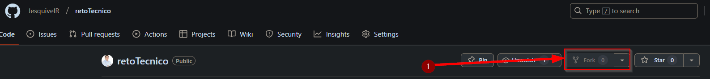
    - Seguir los pasos para realizar la operación de Fork.
      - Colocar una descripción
      - Quitarle el aspa a "Copy the ``Dev`` branch only"
  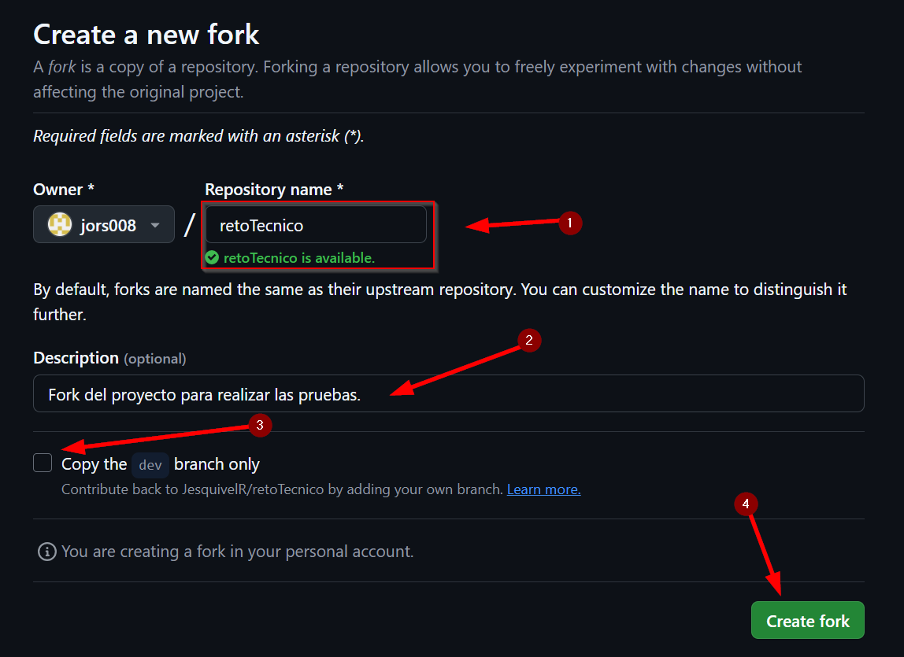
    - Se creará un repositorio en nuestra cuenta con el nombre del repositorio del cual hicimos fork.

3. Clonar el repositorio:
   ```bash
   git clone https://github.com/<Tu_cuenta>/retoTecnico.git
   cd retoTecnico
   ```
### 💡 Explicación de los flujos
1. **Crear infraestructura previa**:
    - Para este paso debemos ejecutar el flujo ``Crear Infraestructura Previa``, este flujo nos permitirá crear los siguientes componentes:
        - **Bucket de S3**: Nos servirá para almacenar el archivo ``tfstate``.
        - **Tabla en DynamoDB**: Nos servirá para gestionar el estado de la infraestructura gestionada por Terraform.
        - **Repositorios en ECR**: Nos permitirá alojar la ``APP1`` y ``APP2`` para luego desplegarlas.
    - **``Este paso tiene como finalidad ejecutarse una sola vez.``**
2. **Dockerizar apps y subirlas al repositorio**:
    - Para este paso debemos ejecutar el flujo ``Build and Push to ECR``, este flujo nos permitirá contenerizar y publicar las imagenes de la APP1 y APP2 las veces que deseemos para que en pasos posteriores puedan ser desplegadas.
    - Este paso tiene como finlidad ejecutarse multiples veces.

3. **Desplegar infraestructura**:
    - Para este paso debemos ejecutar el flujo ``Despliegue o Destrucción de Infraestructura``, este flujo nos permitirá desplegar la infraestructura necesaria para poder ejecutar la imagen previamente publicada en el respectivo repositorio en el paso anterior.
    - Este paso tiene como finlidad ejecutarse multiples veces, ya sea para **desplegar** la infraestructura o **destruirla**.
    

### 🏃 Pasos para la Ejecución
1. **Configurar secretos**:
    - Debemos crear los respectivos secrets de nuestro proyecto, para lo cual nos dirigimos a ``Settings > Secrets and variables > Actions`` y dar clic en ``New Repository Secret``.
    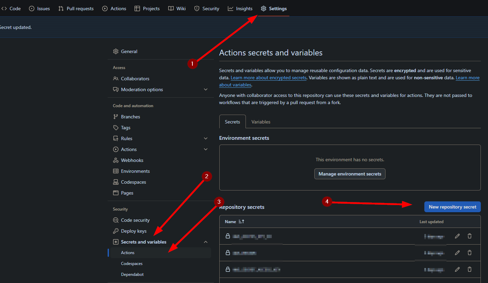
    - Los secrets que debemos configurar son los siguientes:
        - **AWS_ACCESS_KEY_ID**: *Access key de tu cuenta de aws*
        - **AWS_REGION**: <ins>us-west-1</ins>
        - **AWS_SECRET_ACCESS_KEY**: *Secret key de tu cuenta de aws* 
        - **ECR_REGISTRY**: *Esta variable la podemos obtener luego de ejecutar el flujo*
        - **TF_DYNAMODB_TABLE**: <ins>terraform-lock-table</ins>
        - **TF_S3_BUCKET**: *El nombre del bucket debe ser único a nivel global en AWS. Si eliges un nombre ya existente, la creación del bucket fallará. Asegúrate de usar una convención de nombres que garantice unicidad, como incluir identificadores específicos de tu proyecto u organización.*
        - **TF_S3_KEY**: <ins>infra.tfstate</ins>
    - Los unicos valores que te pido que deben mantenerse son los de ``AWS_REGION`` ``TF_DYNAMODB_TABLE`` ``TF_S3_KEY`` los demás pueden variar dependiendo de la cuenta de **AWS** que uses.

    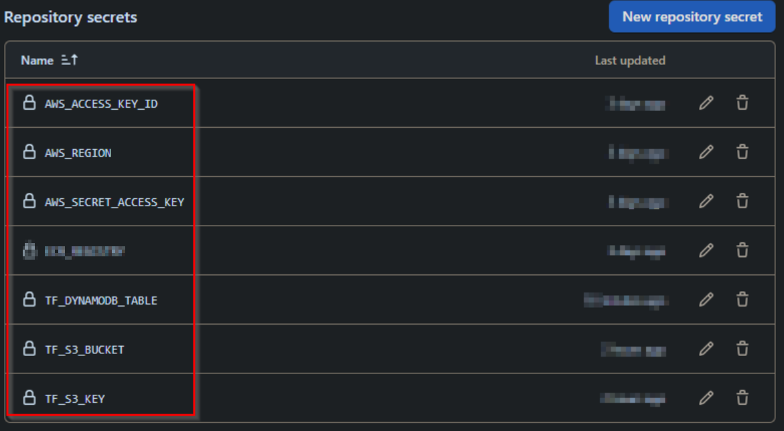

    Como te comenté arriba, la variable ``ECR_REGISTRY`` la generaremos luego de ejecutar el primer workflow.

2. **Ubicarnos en Actions**:
    - Procedemos a activar la sección ``Actions``.
    - Nos dirigimos a ``Actions`` y damos clic en el boton verde cuyo nombre es ``I understand my workflows, go ahead and enable them``.

    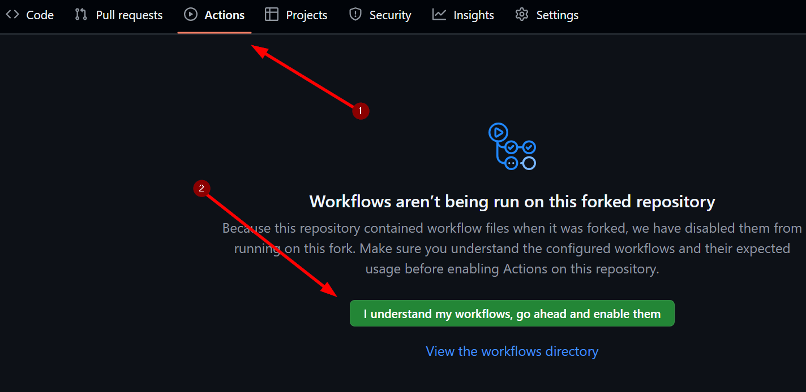
  
    - Debemos dirigirnos a ``Actions `` y ahí podremos visualizar los flujos que tenemos disponibles:

    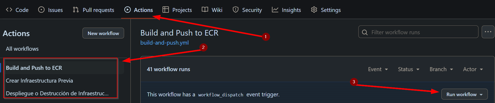

    - Los flujos que tenemos son los siguiente:
            
        1. Crear Infraestructura Previa
        2. Build and Push to ECR
        3. Despliegue o Destrucción de Infraestructura - Dev
        4. Despliegue o Destrucción de Infraestructura - Stage
    - Estos flujos se deben ejecutar en el mismo orden que están enumerados, cada vez que demos clic en alguno podemos visualizar un botón con el nombre ``Run workflow`` el cual al darle clic nos pedirá que seleccionemos la rama deseada.
    - Con respecto a las ramas:
        - La rama ``main``: Contiene todo el proyecto
        - La rama ``dev``: Contiene todo el proyecto y es la rama en la cual se deben hacer cambios en las apps
        - La rama ``deploy_iac``: Contiene todo el proyecto y es la rama que despliega toda la infraestructura para realizar el despliegue.
3. **Desplegar infraestructura previa**:
- Una vez configuradas las variables y ubicados los workflows debemos ejecutar el primer flujo para crear los componentes necesarios para que nuestro proyecto funcione.
- Debemos dar clic en ``Actions > Crear Infraestructura Previa > Run workflow > Branch:main`` y dar clic en ``Run Workflow``.
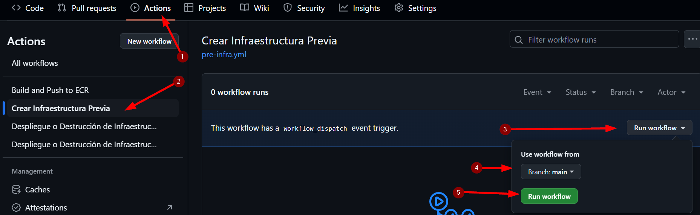
- Esto creará los componentes necesarios en **S3**, **DynamoDB** y **ECR**.
- Actualizamos la pagina para ver el proceso.
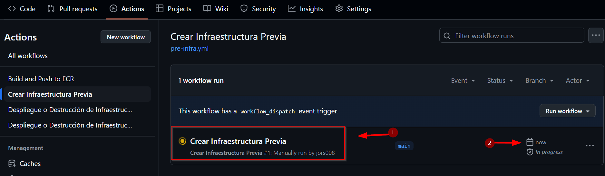
- Una vez culminado se verá de la siguiente manera:
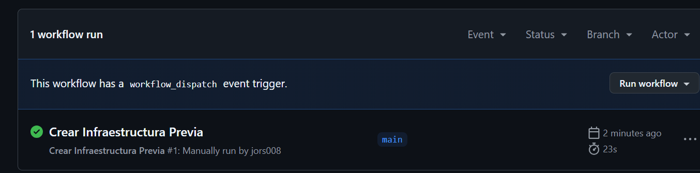
- Si deseamos podemos ingresar para revisar los logs.
- Este workflow nos permitió crear los componentes indicados:

- Recuerda que los Repositorios de ECR y la Tabla de DynamoDB se encuentran en la región que especificamos en las wariables, en este caso ``us-west-1``.
- Con los repositorios de ECR creados ahora si podemos configurar nuestro ultimo secreto  en ``Settings > Secrets and variables > Actions``, recuerda que el secreto que nos faltaba era ``ECR_REGISTRY``.
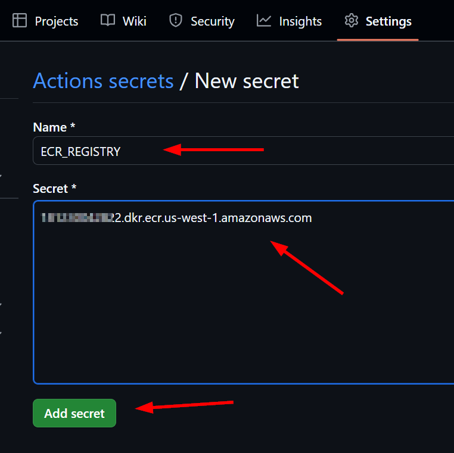
- El valor de ``ECR_REGISTRY`` lo puedes encontrar en **AWS ECR**, en los repositorios que se crearon con el workflow, es la cadena de números que termina en **amazonaws.com**.
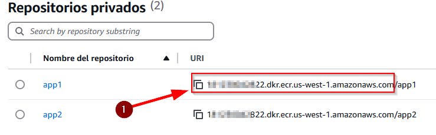
- Finalmente tenemos todos los secrets necesarios para nuestro proyecto:
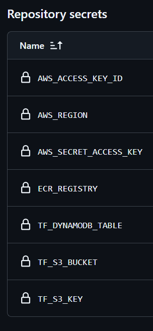

4. **Dockerizar apps y subirlas al repositorio**:
- Debemos dar clic en ``Actions > Build and Push to ECR > Run workflow > Branch:dev`` y dar clic en Run Workflow.
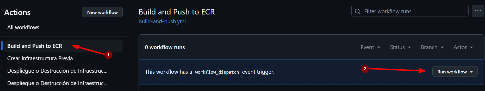
- Esperemos a que termine el workflow
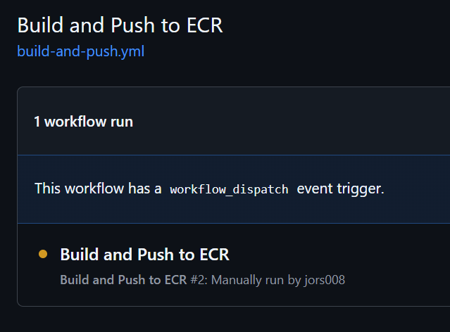
- Este workflow se encargará de contenerizar y subir las aplicaciones que nos proporcionaron en los remositorios mencionados al principio a los repositorios creados:

- Este flujo se puede ejecutar las veces que deseemos subiendo cambios nuevos de las apps, está configurado para siempre tener una imagen Latest y mantener las versiones anteriores.

5. **Desplegar infraestructura**:
- Debemos dar clic en ``Actions > Crear Infraestructura Previa - Dev > Run workflow > Branch:deploy_iac`` y dar clic en Run Workflow.
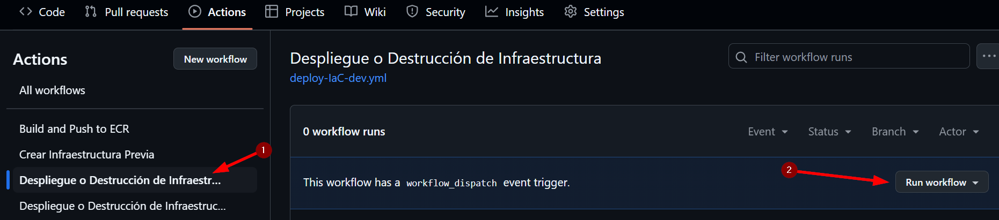
- Una vez ejecutado podemos ingresar al workflow para revisar el proceso:
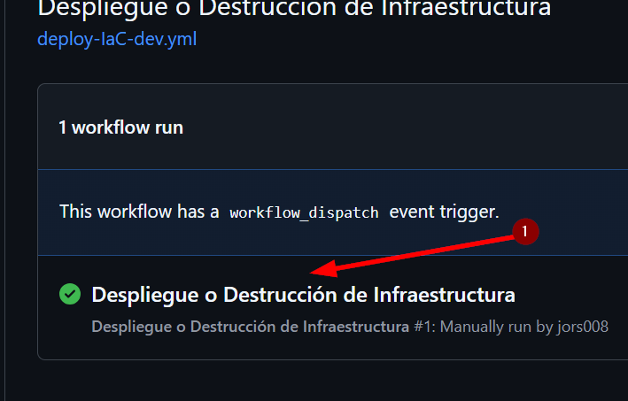
- Una vez finalizado podemos observar que nos proporciona el DNS del Application load Balancer.
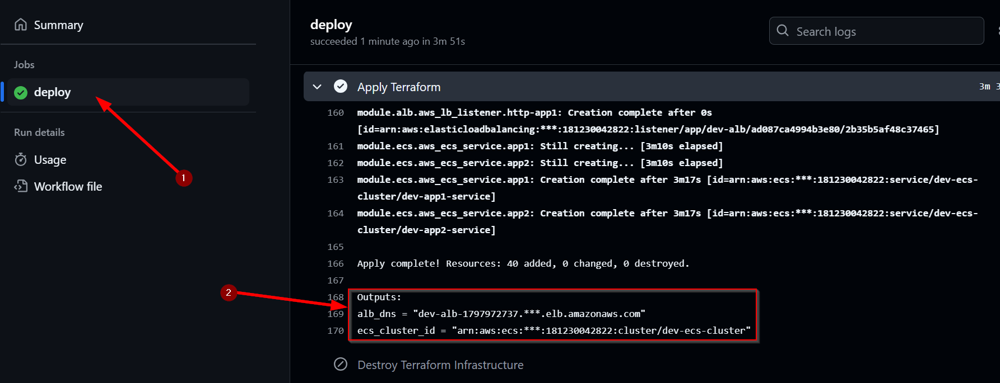
- Por razones de seguridad Github oculta estos datos por los cual debemos buscar este valor en la consola de AWS.
- Debemos dirigirnos al servicio ``EC2`` en AWS y luego ubicarnos en ``Balanceadores de carga``, ahí podremos extraer el ``DNS``.
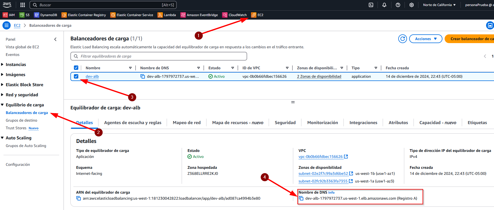
- Ahora podemos consultar esa URL en un navegador, debido a la falta de tiempo no pude configurar ``CloudFront`` y ``Certificate Manager`` para poder acceder de forma segura, por lo tanto tendremos que ingresar via **HTTP**.
- Podemos consultar la URL via curl desde la terminal.
    ```bash
    curl dev-alb-1797972737.us-west-1.elb.amazonaws.com
    ```
- Tambien podemos consultar desde el navegador web usando ``HTTP``.
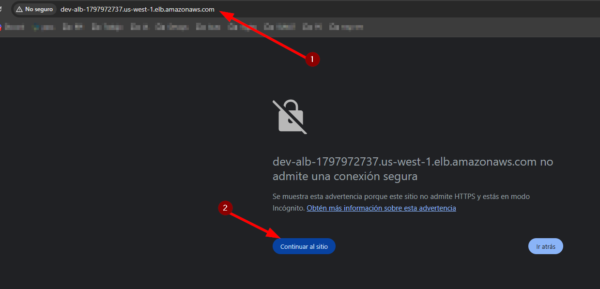

- Deberíamos obtener lo siguiente:
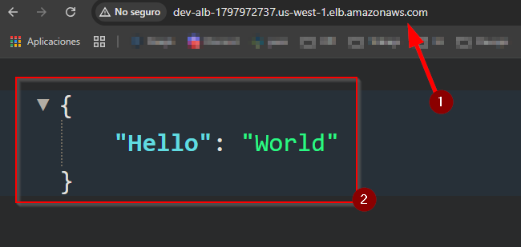

- De esta manera finalizamos la prueba.
- Recuerda que puedes ejecutar las veces que quieras el workflow ```Build and Push to ECR``` cambiando previamente el contenido del archivo [main](./app1/main.py) para que puedas notar los cambios.
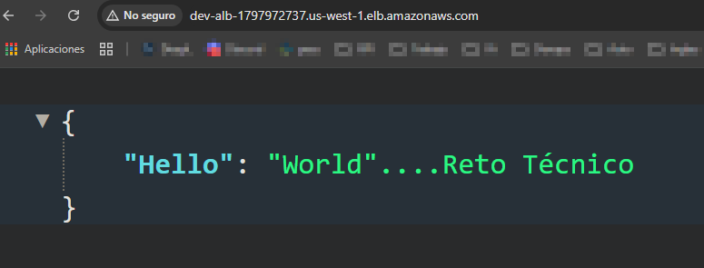

6. **Eliminar infraestructura**:
- Para poder eliminar la infraestructura basatará con modificar la variable de entorno ``DESTROY_INFRA: False`` a ``True`` del archivo [deploy-IaC-dev.yaml](.github/workflows/deploy-IaC-dev.yml), luego se deberá realizar PUSH al repositorio y seguidamente ejecutar el workflow  ``Despliegue o Destrucción de Infraestructura - Dev``.

# 📋 Documentación de configuración en Terraform

# Documentación del Archivo `main.tf` - Configuración de VPC

Este archivo define los recursos necesarios para implementar una VPC con subredes públicas y privadas, un gateway NAT e internet gateway. Está diseñado para entornos escalables y seguros.

---

## **1. Creación de la VPC**

### Recurso: `aws_vpc.this`
- **Descripción:** Crea una VPC con el bloque CIDR especificado.
- **Configuración Clave:**
  - **CIDR:** Se define en la variable `var.cidr`.
  - **Etiquetas:** Asigna un nombre basado en el entorno (`${var.environment}-vpc`).

---

## **2. Subredes Públicas**

### Recurso: `aws_subnet.public`
- **Descripción:** Crea subredes públicas dentro de la VPC.
- **Configuración Clave:**
  - **Cantidad:** Determinada por la longitud de `var.public_subnets`.
  - **CIDR:** Cada subred utiliza los valores en `var.public_subnets`.
  - **Zona de Disponibilidad:** Definida en `var.availability_zones`.
  - **IP Pública:** Habilitada con `map_public_ip_on_launch = true`.
  - **Etiquetas:** Nombres en el formato `${var.environment}-public-subnet-{index}`.

---

## **3. Subredes Privadas**

### Recurso: `aws_subnet.private`
- **Descripción:** Crea subredes privadas dentro de la VPC.
- **Configuración Clave:**
  - **Cantidad:** Determinada por la longitud de `var.private_subnets`.
  - **CIDR:** Utiliza los valores en `var.private_subnets`.
  - **Zona de Disponibilidad:** Configurada con `var.availability_zones`.
  - **Etiquetas:** Nombres en el formato `${var.environment}-private-subnet-{index}`.

---

## **4. Internet Gateway**

### Recurso: `aws_internet_gateway.this`
- **Descripción:** Permite que las subredes públicas tengan acceso a internet.
- **Configuración Clave:**
  - **VPC Asociada:** La VPC creada en `aws_vpc.this`.
  - **Etiquetas:** Nombre en el formato `${var.environment}-internet-gateway`.

---

## **5. Tabla de Rutas Públicas**

### Recurso: `aws_route_table.public`
- **Descripción:** Configura una tabla de rutas para las subredes públicas.
- **Configuración Clave:**
  - **VPC Asociada:** `aws_vpc.this`.
  - **Ruta por Defecto:**
    - **Destino:** `0.0.0.0/0` (todo el tráfico externo).
    - **Gateway:** `aws_internet_gateway.this.id`.
  - **Etiquetas:** Nombre en el formato `${var.environment}-public-route-table`.

### Asociación de Tabla de Rutas
- **Recurso:** `aws_route_table_association.public`
- **Descripción:** Asocia la tabla de rutas públicas con cada subred pública.

---

## **6. NAT Gateway**

### Recurso: `aws_nat_gateway.this`
- **Descripción:** Permite que las subredes privadas accedan a internet para tareas como actualizaciones de paquetes.
- **Configuración Clave:**
  - **Elastic IP:** Asignado mediante `aws_eip.nat.id`.
  - **Subred:** Implementado en la primera subred pública (`aws_subnet.public[0]`).
  - **Etiquetas:** Nombre en el formato `${var.environment}-nat-gateway`.

---

## **7. Elastic IP para NAT**

### Recurso: `aws_eip.nat`
- **Descripción:** Proporciona una dirección IP estática para el NAT Gateway.
- **Configuración Clave:**
  - **Dependencia:** Creado después del Internet Gateway (`depends_on = [aws_internet_gateway.this]`).

---

## **8. Tabla de Rutas Privadas**

### Recurso: `aws_route_table.private`
- **Descripción:** Configura una tabla de rutas para las subredes privadas.
- **Configuración Clave:**
  - **VPC Asociada:** `aws_vpc.this`.
  - **Ruta por Defecto:**
    - **Destino:** `0.0.0.0/0`.
    - **Gateway NAT:** `aws_nat_gateway.this.id`.
  - **Etiquetas:** Nombre en el formato `${var.environment}-private-route-table`.

### Asociación de Tabla de Rutas
- **Recurso:** `aws_route_table_association.private`
- **Descripción:** Asocia la tabla de rutas privadas con cada subred privada.

---

# Resumen
Este archivo implementa:
1. Una **VPC** con subredes públicas y privadas.
2. Un **Internet Gateway** para las subredes públicas.
3. Un **NAT Gateway** para proporcionar conectividad a internet desde subredes privadas.
4. Tablas de rutas públicas y privadas para gestionar el flujo de tráfico.

Esta configuración es útil para arquitecturas donde las instancias en subredes privadas necesitan acceso a internet sin ser accesibles directamente desde el exterior.


# Documentación del Archivo `main.tf` - Configuración de IAM

Este archivo define roles y políticas IAM necesarios para habilitar la ejecución de tareas ECS. A continuación, se explica cada recurso configurado.

---

## **1. Rol de Ejecución para ECS**

### Recurso: `aws_iam_role.ecs_execution`
- **Descripción:** Crea un rol que será asumido por tareas ECS para acceder a servicios de AWS como ECR y CloudWatch.
- **Configuración Clave:**
  - **Nombre:** `${var.environment}-ecs-execution-role` (incluye el entorno).
  - **Política de Asunción:** Permite que el servicio `ecs-tasks.amazonaws.com` asuma este rol.
  - **Ejemplo de Política:**
    ```json
    {
      "Version": "2012-10-17",
      "Statement": [
        {
          "Effect": "Allow",
          "Principal": { "Service": "ecs-tasks.amazonaws.com" },
          "Action": "sts:AssumeRole"
        }
      ]
    }
    ```

---

## **2. Adjuntar Política Administrada al Rol de Ejecución**

### Recurso: `aws_iam_role_policy_attachment.ecs_execution_policy`
- **Descripción:** Vincula la política administrada de AWS `AmazonECSTaskExecutionRolePolicy` al rol de ejecución para permitir:
  - Recuperar imágenes desde ECR.
  - Registrar logs en CloudWatch.
- **Configuración Clave:**
  - **Policy ARN:** `arn:aws:iam::aws:policy/service-role/AmazonECSTaskExecutionRolePolicy`.

---

## **3. Política en Línea para el Rol de Ejecución**

### Recurso: `aws_iam_role_policy.ecs_execution_policy_inline`
- **Descripción:** Define permisos adicionales para que las tareas ECS puedan crear grupos de logs en CloudWatch.
- **Configuración Clave:**
  - **Nombre:** `${var.environment}-ecs-execution-policy-inline`.
  - **Acción Permitida:** `logs:CreateLogGroup`.
  - **Recursos Permitidos:** `arn:aws:logs:*:*:*` (todos los grupos de logs).

---

## **4. Rol para las Tareas de ECS**

### Recurso: `aws_iam_role.ecs_task`
- **Descripción:** Crea un rol asumido por las tareas ECS para ejecutar contenedores con permisos personalizados.
- **Configuración Clave:**
  - **Nombre:** `${var.environment}-ecs-task-role`.
  - **Política de Asunción:** Permite que `ecs-tasks.amazonaws.com` asuma este rol.
  - **Ejemplo de Política:**
    ```json
    {
      "Version": "2012-10-17",
      "Statement": [
        {
          "Effect": "Allow",
          "Principal": { "Service": "ecs-tasks.amazonaws.com" },
          "Action": "sts:AssumeRole"
        }
      ]
    }
    ```

---

## **5. Adjuntar Política Administrada al Rol de Tareas**

### Recurso: `aws_iam_role_policy_attachment.ecs_task_policy_attachment`
- **Descripción:** Vincula la política administrada de AWS `AmazonECSTaskExecutionRolePolicy` al rol de tareas ECS, otorgando permisos generales para la ejecución de contenedores.

---

## **6. Política en Línea para las Tareas de ECS**

### Recurso: `aws_iam_role_policy.ecs_task_policy`
- **Descripción:** Adjunta una política personalizada al rol de tareas ECS. 
- **Configuración Clave:**
  - **Nombre:** `${var.environment}-ecs-task-policy`.
  - **Política:** Definida en un archivo externo (`ecs_task_policy.json`), que incluye permisos específicos para la lógica de la aplicación.

---

# Resumen
Este archivo configura los elementos necesarios para que ECS interactúe con los recursos de AWS:
1. **Rol de Ejecución (`ecs_execution`):** Habilita la interacción con ECR y CloudWatch.
2. **Rol de Tareas (`ecs_task`):** Proporciona permisos personalizados para ejecutar tareas ECS.
3. **Políticas Administradas y En Línea:** Combina permisos estándar y específicos para cada ambiente.

---

# Documentación del Archivo `main.tf` - Configuración de ECS


Este archivo `main.tf` configura un clúster de **AWS ECS** utilizando Fargate para desplegar dos aplicaciones (`app1` y `app2`). A continuación, se describe cada componente en detalle.

---

## **1. Clúster de ECS**
Se crea un clúster ECS para alojar las tareas:

```hcl
resource "aws_ecs_cluster" "this" {
  name = "${var.environment}-ecs-cluster"
}
```
## **2. Definiciones de Tarea (Task Definitions)**
Se definen las tareas de ECS para cada aplicación. Las tareas incluyen configuración del contenedor, red, y monitoreo.

#### **Tarea de `app1`**

```hcl
resource "aws_ecs_task_definition" "app1" {
  family                   = "${var.environment}-${var.app1_image}-task"
  network_mode             = "awsvpc"
  requires_compatibilities = ["FARGATE"]
  cpu                      = "1024"
  memory                   = "3072"
  execution_role_arn       = var.execution_role_arn
  task_role_arn            = var.task_role_arn

  runtime_platform {
    operating_system_family = "LINUX"
    cpu_architecture        = "X86_64"
  }

  container_definitions = jsonencode([
    {
      name      = var.app1_image
      image     = "${var.repositorio_ecr}/${var.app1_image}:${var.image_tag}"
      essential = true
      portMappings = [
        {
          name          = "${var.app1_image}-8000-tcp"
          containerPort = 8000
          hostPort      = 8000
          protocol      = "tcp"
          appProtocol   = "http"
        }
      ]
      environment = [
        {
          name  = "ENV"
          value = var.environment
        }
      ]
      logConfiguration = {
        logDriver = "awslogs"
        options = {
          "awslogs-group"         = "/ecs/${var.environment}-${var.app1_image}"
          "awslogs-region"        = var.aws_region
          "awslogs-create-group"  = "true"
          "awslogs-stream-prefix" = "ecs"
          "mode"                  = "non-blocking"
          "max-buffer-size"       = "25m"
        }
      }
    }
  ])
}
```
#### **Tarea de `app2`**
```hcl
resource "aws_ecs_task_definition" "app2" {
  family                   = "${var.environment}-${var.app2_image}-task"
  network_mode             = "awsvpc"
  requires_compatibilities = ["FARGATE"]
  cpu                      = "1024"
  memory                   = "2048"
  execution_role_arn       = var.execution_role_arn
  task_role_arn            = var.task_role_arn

  runtime_platform {
    operating_system_family = "LINUX"
    cpu_architecture        = "X86_64"
  }

  container_definitions = jsonencode([
    {
      name      = var.app2_image
      image     = "${var.repositorio_ecr}/${var.app2_image}:${var.image_tag}"
      portMappings = [
        {
          name          = "${var.app2_image}-8000-tcp"
          containerPort = 8000
          hostPort      = 8000
          protocol      = "tcp"
          appProtocol   = "http"
        }
      ]
      environment = [
        {
          name  = "ENV"
          value = var.environment
        }
      ]
      logConfiguration = {
        logDriver = "awslogs"
        options = {
          "awslogs-group"         = "/ecs/${var.environment}-${var.app2_image}"
          "awslogs-region"        = var.aws_region
          "awslogs-create-group"  = "true"
          "awslogs-stream-prefix" = "ecs"
          "mode"                  = "non-blocking"
          "max-buffer-size"       = "25m"
        }
      }
    }
  ])
}
```

## **3. Servicios ECS (ECS Services)**
Cada aplicación se configura como un servicio ECS para asegurar la disponibilidad y administración del ciclo de vida.

#### **Servicio de `app1`**

```hcl
resource "aws_ecs_service" "app1" {
  name            = "${var.environment}-${var.app1_image}-service"
  cluster         = aws_ecs_cluster.this.id
  task_definition = aws_ecs_task_definition.app1.arn
  desired_count   = var.desired_count
  launch_type     = "FARGATE"

  network_configuration {
    subnets         = var.subnets
    security_groups = [var.security_group_id]
    assign_public_ip = false
  }

  load_balancer {
    target_group_arn = var.app1_target_group_arn
    container_name   = var.app1_image
    container_port   = 8000
  }
}
```

#### **Servicio de `app2`**

```hcl
resource "aws_ecs_service" "app2" {
  name            = "${var.environment}-${var.app2_image}-service"
  cluster         = aws_ecs_cluster.this.id
  task_definition = aws_ecs_task_definition.app2.arn
  desired_count   = var.desired_count
  launch_type     = "FARGATE"

  network_configuration {
    subnets         = var.subnets
    security_groups = [var.security_group_id]
    assign_public_ip = false
  }

  load_balancer {
    target_group_arn = var.app2_target_group_arn
    container_name   = var.app2_image
    container_port   = 8000
  }
}
```
# Resumen
Este archivo implementa:
1. Un **clúster de ECS** para ejecutar las tareas.
2. Define las **tareas ECS** para `app1` y `app2` con sus configuraciones específicas:
   - Recursos como CPU, memoria y roles de ejecución.
   - Definiciones del contenedor, incluyendo puertos, variables de entorno y configuración de logs.
3. Configura los **servicios ECS** para `app1` y `app2`, asegurando alta disponibilidad y conectividad con subredes y balanceadores de carga.

# Documentación del Archivo `main.tf` - Configuración de ALB

Este archivo `main.tf` configura un **Application Load Balancer (ALB)** en AWS para enrutar el tráfico hacia dos aplicaciones (`app1` y `app2`) utilizando Terraform. A continuación, se describen los recursos creados.

---
## 1. Application Load Balancer (ALB)
Se crea un ALB que distribuye tráfico hacia las aplicaciones configuradas.

```hcl
resource "aws_lb" "this" {
  name               = "${var.environment}-alb"
  internal           = false
  load_balancer_type = "application"
  security_groups    = [var.security_group_id]
  subnets            = var.subnets

  enable_deletion_protection = false

  tags = {
    Environment = var.environment
  }
}
```
## 2. Grupos de Destino (Target Groups)

**Grupo de destino para ```app1```**
- Define el puerto, protocolo y verificaciones de salud específicas para la primera aplicación.
```hcl
resource "aws_lb_target_group" "app1" {
  name        = "${var.environment}-${var.app1_image}-tg"
  port        = 8000
  protocol    = "HTTP"
  vpc_id      = var.vpc_id
  target_type = "ip"

  health_check {
    path                = "/"
    interval            = 30
    timeout             = 5
    healthy_threshold   = 5
    unhealthy_threshold = 2
    matcher             = "200-299"
  }

  tags = {
    Environment = var.environment
  }
}
```
**Grupo de destino para ```app2```**
- Similar al grupo de destino de app1, pero con configuración específica para la segunda aplicación.
```hcl
resource "aws_lb_target_group" "app2" {
  name        = "${var.environment}-${var.app2_image}-tg"
  port        = 8000
  protocol    = "HTTP"
  vpc_id      = var.vpc_id
  target_type = "ip"

  health_check {
    path                = "/"
    interval            = 30
    timeout             = 5
    healthy_threshold   = 5
    unhealthy_threshold = 2
    matcher             = "200-299"
  }

  tags = {
    Environment = var.environment
  }
}
```

## 3. Listeners
Se configuran listeners para enrutar el tráfico HTTP a los grupos de destino.

**Listener para ```app1```**
- Enruta tráfico HTTP en el puerto 80 hacia el grupo de destino de app1.
```hcl
resource "aws_lb_listener" "http-app1" {
  load_balancer_arn = aws_lb.this.arn
  port              = "80"
  protocol          = "HTTP"

  default_action {
    type             = "forward"
    target_group_arn = aws_lb_target_group.app1.arn
  }
}

```
**Listener para ```app2```**
- Enruta tráfico HTTP en el puerto 8080 hacia el grupo de destino de app2.
```hcl
resource "aws_lb_listener" "http-app2" {
  load_balancer_arn = aws_lb.this.arn
  port              = "8080"
  protocol          = "HTTP"

  default_action {
    type             = "forward"
    target_group_arn = aws_lb_target_group.app2.arn
  }
}
```
---
# **Resumen**
Este script de Terraform realiza las siguientes configuraciones principales:

1. Crea un **Application Load Balancer** con seguridad y configuración específicas.
2. Define **grupos de destino (Target Groups)** para las aplicaciones:
   - Configuración de los puertos, protocolos y verificaciones de salud.
3. Configura **listeners** que enrutan tráfico HTTP a los grupos de destino correspondientes.

---

# 📋 Documentación del Archivo `main.tf` - Actualización de Despliegues con Lambda y ECS

Este archivo define los recursos necesarios para implementar una función Lambda que actualiza servicios ECS al recibir eventos de push en ECR. Está diseñado para ser escalable, eficiente y automatizado.

---

## **1. Roles y Políticas de IAM**

### Recurso: `aws_iam_role.lambda_role`
- **Descripción:** Rol IAM que permite a Lambda asumir permisos necesarios.
- **Configuración Clave:**
  - **Política de Asunción:** Permite que `lambda.amazonaws.com` asuma este rol.
  - **Etiquetas:** Nombre del rol basado en el entorno (`lambda-role-${var.environment}`).

### Recurso: `aws_iam_role_policy_attachment.lambda_policy_attachment`
- **Descripción:** Adjunta la política básica de ejecución para Lambda.
- **Configuración Clave:**
  - **Política:** `AWSLambdaBasicExecutionRole`.

### Recurso: `aws_iam_policy.ecs_permissions`
- **Descripción:** Política personalizada que otorga permisos para interactuar con ECS.
- **Configuración Clave:**
  - **Permisos Incluidos:**
    - `ecs:RegisterTaskDefinition`
    - `ecs:UpdateService`
    - `ecs:DescribeServices`
    - `ecs:DescribeClusters`
    - `ecs:ListServices`
    - `iam:PassRole`
  - **Alcance:** Aplicado a todos los recursos (`Resource = ["*"]`).

### Recurso: `aws_iam_role_policy_attachment.ecs_policy_attachment`
- **Descripción:** Adjunta la política personalizada a la función Lambda.
- **Configuración Clave:**
  - **Rol Asociado:** `lambda-role-${var.environment}`.

---

## **2. Función Lambda**

### Recurso: `aws_lambda_function.update_deploy_lambda`
- **Descripción:** Función Lambda que actualiza los servicios ECS tras un evento de push en ECR.
- **Configuración Clave:**
  - **Nombre:** `update-deploy-${var.environment}`.
  - **Rol Asociado:** `lambda-role-${var.environment}`.
  - **Código Fuente:** `lambda.zip` ubicado en el directorio del módulo.
  - **Variables de Entorno:**
    - `ECS_CLUSTER`
    - `ENVIRONMENT`
    - `EXECUTION_ROLE`
    - `TASK_ROLE`
    - `REPOSITORIO_ECR`
  - **Etiquetas:** Nombre con el formato `update-deploy-${var.environment}`.

---

## **3. Regla de CloudWatch para Disparadores**

### Recurso: `aws_cloudwatch_event_rule.ecr_push_rule`
- **Descripción:** Configura un disparador basado en eventos de push en repositorios ECR.
- **Configuración Clave:**
  - **Evento:** `ECR Image Action` con acción de tipo `PUSH` y resultado `SUCCESS`.
  - **Filtros Personalizados:**
    - Repositorios: `${var.app1_image}`, `${var.app2_image}`.
    - Etiqueta de Imagen: `${var.image_tag}`.

### Recurso: `aws_cloudwatch_event_target.ecr_push_lambda_target`
- **Descripción:** Asocia la regla de CloudWatch con la función Lambda.
- **Configuración Clave:**
  - **Regla:** `ecr-push-rule-${var.environment}`.
  - **Destino:** ARN de la función Lambda.

---

## **4. Permiso para Lambda desde EventBridge**

### Recurso: `aws_lambda_permission.allow_eventbridge`
- **Descripción:** Permite a EventBridge invocar la función Lambda.
- **Configuración Clave:**
  - **Principal:** `events.amazonaws.com`.
  - **ARN de la Fuente:** Regla de CloudWatch `ecr-push-rule-${var.environment}`.

---

## **5. Datos de Identidad del Llamador**

### Data Source: `aws_caller_identity.current`
- **Descripción:** Obtiene información sobre la cuenta de AWS actual para su uso en configuraciones adicionales.

---

# Resumen

Este archivo implementa:
1. Un **rol IAM** y políticas necesarias para la ejecución de Lambda y la interacción con ECS.
2. Una **función Lambda** que actualiza servicios ECS tras eventos de push en ECR.
3. Configuración de **reglas de CloudWatch** para desencadenar la función Lambda.
4. Permisos explícitos para que EventBridge invoque la función Lambda.

Esta configuración automatiza los despliegues en ECS, asegurando un flujo continuo desde la construcción de imágenes en ECR hasta la actualización de servicios en ECS.

**De esta manera finalizamos el desarrollo del reto técnico.**

## Authors

- [@JesquivelR](https://www.github.com/JesquivelR)