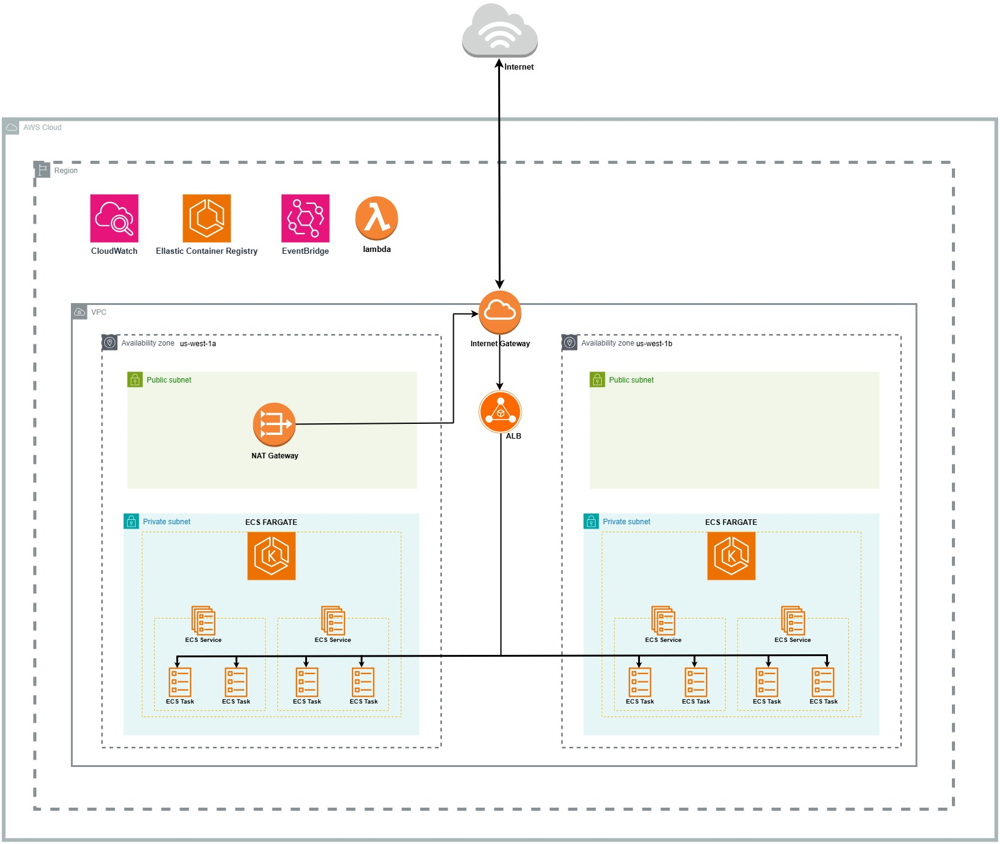

# 🌐 Diseño de Infraestructura para Aplicaciones en AWS

## 🎯 Objetivo
Diseñar y desplegar una infraestructura escalable, segura y de alta disponibilidad en AWS que soporte aplicaciones modernas basadas en contenedores, utilizando servicios como ECS Fargate, NAT Gateway y Application Load Balancer (ALB), Lambda y EventBridge.

---

## 🎨 Diagrama de la Arquitectura
La arquitectura se basa en una configuración modular que incluye VPC, subnets públicas y privadas, balanceo de carga, y contenedores gestionados por ECS Fargate. Se han seleccionado servicios gestionados para garantizar una operación eficiente.

## 🧩 Descripción de la Arquitectura
La arquitectura diseñada está dividida en los siguientes componentes principales:

### 1. **🌍 VPC (Virtual Private Cloud)**
- Una VPC que define el alcance de la red donde se alojarán todos los recursos.

### 2. **🗂️ Subnets**
- **Subnets Públicas**:
  - Almacenan recursos como el NAT Gateway y el ALB que necesitan acceso directo a Internet.
  - Cada subnet está asociada a una zona de disponibilidad para alta disponibilidad.
- **Subnets Privadas**:
  - Almacenan servicios críticos como ECS Fargate que no requieren acceso directo a Internet.
  - Configuradas para enrutar su tráfico a través de un NAT Gateway.

### 3. **🚪 Internet Gateway (IGW)**
- Permite la conexión entre la VPC y la Internet pública.
- Asociado a las subnets públicas para que los recursos puedan enviar y recibir tráfico de Internet.

### 4. **🔒 NAT Gateway**
- Utilizado para que las subnets privadas puedan acceder a Internet de forma segura.
- Implementado en una de las subnets públicas.

### 5. **📋 Route Tables**
- **Tabla de Rutas Públicas**:
  - Dirige el tráfico de las subnets públicas a través del Internet Gateway.
- **Tabla de Rutas Privadas**:
  - Dirige el tráfico de las subnets privadas a través del NAT Gateway.

### 6. **⚖️ Application Load Balancer (ALB)**
- Distribuye el tráfico de manera equitativa a las tareas ECS que corren en las subnets privadas.
- Configurado con listeners que manejan solicitudes HTTP/HTTPS.

### 7. **📦 ECS Fargate**
- Servicio gestionado de contenedores que permite correr tareas y servicios sin necesidad de administrar servidores.
- Implementado en subnets privadas para mejorar la seguridad.

### 8. **📅 Amazon EventBridge**
- Servicio de enrutamiento de eventos que captura eventos de aplicaciones y servicios, y los redirige a destinos como Lambda o SNS.
- La idea es capturar operaciones ``PUSH`` en ECR para desencadenar una funcion lambda.

### **9. 🐍 AWS Lambda**
- Ejecuta funciones sin servidor en respuesta a eventos, automatizando tareas sin necesidad de administrar infraestructura.
- Se ejecuta una función que actualizará la definición de tareas en ECS Fargate.

---

## 🛠️ Decisiones de Diseño

### 1. **Alta Disponibilidad 🚦**
- Uso de subnets distribuidas en múltiples zonas de disponibilidad para garantizar redundancia.
- Componentes como el ALB y el NAT Gateway están diseñados para soportar fallos en una zona de disponibilidad.

### 2. **Seguridad 🔐**
- Los recursos en subnets privadas no tienen acceso directo a Internet.
- Uso de un ALB para limitar el acceso a las tareas ECS.
- Tráfico entre los componentes restringido mediante grupos de seguridad.

### 3. **Escalabilidad 📈**
- El uso de ECS Fargate permite escalar automáticamente las tareas según la carga.
- La configuración del ALB soporta reglas de enrutamiento para manejar varias aplicaciones.

### 4. **Simplicidad Operacional ⚙️**
- Uso de servicios gestionados como ECS Fargate, ALB y CloudWatch reduce la carga operativa.
- Configuración basada en Terraform facilita la reproducibilidad y el control de versiones.

---

## 📊 Consideraciones Adicionales

1. **Monitoreo y Logging 📡**:
   - Uso de CloudWatch para monitorear recursos y registrar eventos de ECS Fargate, ALB y NAT Gateway.
2. **Gestión de Imágenes 🖼️**:
   - Uso de Elastic Container Registry (ECR) para almacenar las imágenes utilizadas por ECS Fargate.
3. **Costos 💲**:
   - Diseño optimizado para minimizar costos utilizando servicios gestionados y escalabilidad automática.

## 🧩 Uso de Módulos en Terraform

### 📖 Introducción
En el diseño de la infraestructura se ha adoptado el uso de **módulos de Terraform** como una práctica clave para la organización y reutilización del código. Los módulos permiten descomponer la infraestructura en componentes más pequeños, manejables y reutilizables, facilitando la colaboración y el mantenimiento.

### 🚀 Razones para Usar Módulos
1. **Reutilización del Código**:
   - Los módulos permiten definir un componente de infraestructura una vez y reutilizarlo en diferentes entornos como `dev` y `prod`.
2. **Organización del Proyecto**:
   - La estructura modular mantiene el proyecto limpio y legible, separando componentes críticos como la VPC, ALB y ECS en sus propios directorios.
3. **Escalabilidad**:
   - Facilitan la expansión y mantenimiento de la infraestructura, ya que cada módulo se puede actualizar de manera independiente.
4. **Colaboración**:
   - La separación en módulos permite que diferentes equipos trabajen en paralelo en diferentes partes de la infraestructura.

### 📋 Ventajas de los Módulos

| Ventaja                      | Descripción                                                                 |
|------------------------------|-----------------------------------------------------------------------------|
| **Reutilización**            | Un módulo puede ser usado en múltiples entornos o proyectos.               |
| **Simplificación**           | Reduce la cantidad de código duplicado, mejorando la legibilidad.          |
| **Mantenibilidad**           | Los cambios realizados en un módulo afectan de manera consistente a todos los entornos. |
| **Separación de Preocupaciones** | Divide la infraestructura en partes manejables y lógicas.                |
| **Estandarización**          | Facilita la aplicación de estándares organizacionales al desarrollo de infraestructura. |
| **Facilidad para Depuración**| Al tener componentes independientes, es más fácil aislar y resolver problemas. |

### 📦 Ejemplo de los Módulos
En este proyecto, se han definido los siguientes módulos en el directorio `terraform/modules`:
- **VPC**:
  - Define la red principal con subnets públicas y privadas.
- **ALB**:
  - Configura el Application Load Balancer para distribuir tráfico.
- **ECS**:
  - Gestiona la configuración del servicio ECS y tareas en Fargate.
- **IAM**:
  - Proporciona políticas y roles necesarios para la ejecución de tareas en ECS.
- **EventBridge**:
  - Configura el enrutamiento de eventos desde diferentes fuentes a destinos como Lambda o SNS.
- **Lambda**:
  - Define las funciones sin servidor que se activan por eventos para realizar tareas automatizadas, como procesamiento o notificaciones.

---
## ✅ Conclusión
Este diseño ofrece una infraestructura segura, escalable y preparada para manejar cargas de trabajo modernas basadas en contenedores. Las decisiones tomadas priorizan la alta disponibilidad, simplicidad operativa y seguridad, alineándose con las mejores prácticas de AWS.